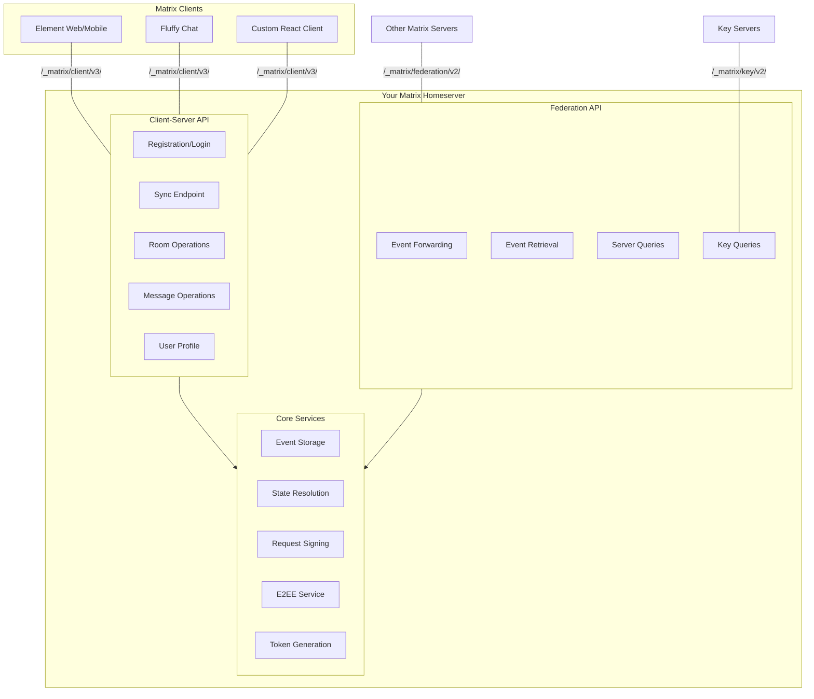
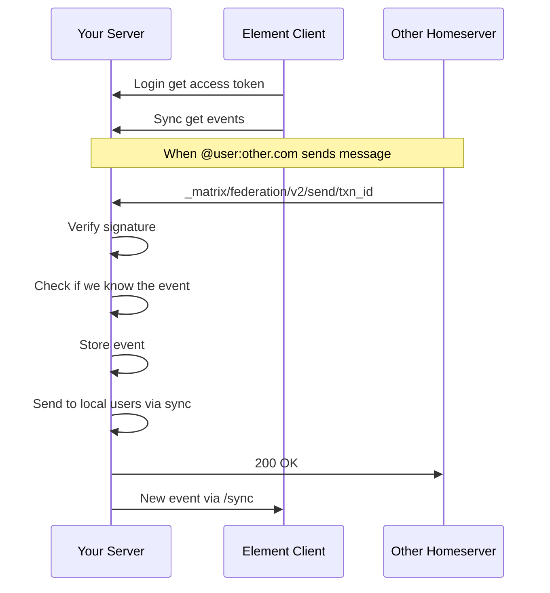
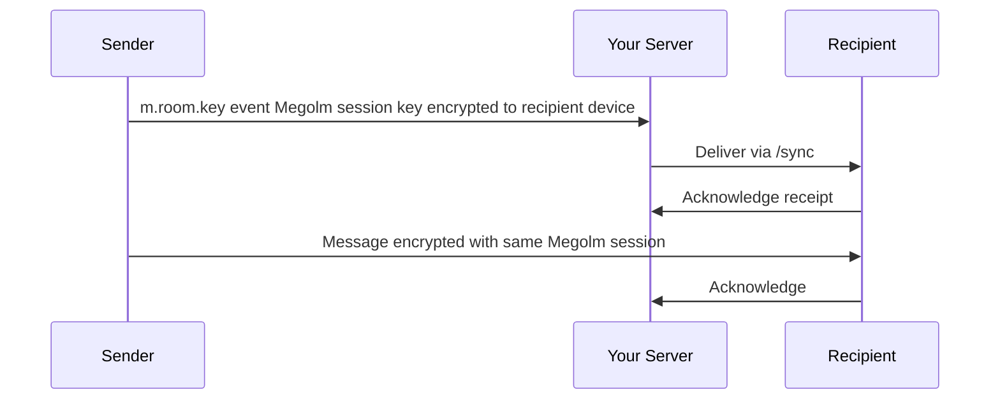

# Matrix Protocol Integration Plan

## Overview

This plan outlines the steps to transform `monchat` from a proprietary messenger with Matrix-inspired types into a **fully Matrix-compatible homeserver**. This means your server will speak the official Matrix Client-Server API and Federation API, enabling communication with any Matrix client (Element, Fluffy, etc.) and any Matrix server worldwide.

---

## Current State Analysis

| Aspect | Current Implementation | Matrix Target |
|---|---|---|
| API Path | `/api/v1/...` | `/_matrix/client/v3/...` |
| Auth | `X-User-ID` header (insecure) | Access Token + Refresh Token |
| Password Hash | SHA256 | bcrypt / Argon2 |
| Message Type | `m.text`, `m.emote` | Full event content format |
| Room ID | UUID (`550e8400...`) | Matrix format (`!roomid:server.com`) |
| User ID | UUID (`550e8400...`) | Matrix MXID (`@user:server.com`) |
| Real-time | Custom WebSocket hub | `/sync` endpoint + WS |
| Federation | Not implemented | `_matrix/federation/v2/` |
| E2EE | Not implemented | Olm/Megolm cryptography |

---

## Architecture Overview



---

## Phase 1: Foundation - Matrix Identifiers and Token Auth

### 1.1 Matrix Identifier Format

**Goal:** Replace raw UUIDs with proper Matrix-style IDs.

#### Changes needed:

**New file:** `server/internal/models/matrix_id.go`

```
- User ID format: @username:domain.com  (MXID internal: !userid:domain.com)
- Room ID format: !roomid:domain.com
- Event ID format: $eventid:domain.com
- Transaction ID format: {client_name}_{timestamp}_{random}
```

**Database changes:**
- Add `localpart` column to `users` table (the part before `:` in MXID)
- Add `server_name` configuration value
- Keep internal UUIDs but add display-format computed columns

**Files to modify:**
- [`server/internal/database/postgres.go`](server/internal/database/postgres.go:36) — add `localpart` column
- [`server/internal/models/user.go`](server/internal/models/user.go:7) — add LocalPart field
- [`server/cmd/main.go`](server/cmd/main.go:17) — add `SERVER_NAME` env var

### 1.2 JWT Token Authentication

**Goal:** Replace insecure `X-User-ID` header with proper JWT access tokens.

**New file:** `server/internal/auth/jwt.go`

```go
// Features:
// - Generate access token on login/register
// - Validate token middleware
// - Refresh token flow
// - Token stored in client, sent as Bearer token
```

**Middleware pattern:**
```
Request -> AuthMiddleware -> Extract Bearer Token -> Validate JWT -> Set UserID in context -> Handler
```

**Files to modify:**
- [`server/internal/services/auth_service.go`](server/internal/services/auth_service.go:22) — return token on register/login
- [`server/internal/api/handlers.go`](server/internal/api/handlers.go:110) — use context userID instead of header
- [`server/internal/api/routes.go`](server/internal/api/routes.go:10) — add middleware registration
- [`client-web/src/services/api.ts`](client-web/src/services/api.ts:39) — send Bearer token

### 1.3 Password Hashing Upgrade

**Goal:** Replace SHA256 with bcrypt.

**Files to modify:**
- [`server/internal/services/auth_service.go`](server/internal/services/auth_service.go:4) — replace `crypto/sha256` with `golang.org/x/crypto/bcrypt`
- [`server/internal/services/auth_service.go`](server/internal/services/auth_service.go:72) — use `bcrypt.GenerateFromPassword` / `bcrypt.CompareHashAndPassword`

---

## Phase 2: Client-Server API Compliance

### 2.1 Matrix Client-Server Endpoints

**Goal:** Implement official `/_matrix/client/` endpoints alongside existing `/api/v1/`.

**New directory:** `server/internal/matrix/clientapi/`

| Matrix Endpoint | Method | Your Current Equivalent | Status |
|---|---|---|---|
| `/_matrix/client/v3/login` | POST | `/api/v1/login` | Need to add |
| `/_matrix/client/v3/register` | POST | `/api/v1/register` | Need to add |
| `/_matrix/client/v3/sync` | GET | WebSocket hub | Need to add |
| `/_matrix/client/v3/rooms/{roomId}` | GET/PUT/DELETE | `/api/v1/rooms` | Need to add |
| `/_matrix/client/v3/rooms/{roomId}/state/{eventType}` | GET/PUT | Room settings | Need to add |
| `/_matrix/client/v3/rooms/{roomId}/send/{eventType}` | POST | `/api/v1/rooms/{id}/messages` | Need to add |
| `/_matrix/client/v3/rooms/{roomId}/messages` | GET/POST | `/api/v1/rooms/{id}/messages` | Need to add |
| `/_matrix/client/v3/profile/{userId}` | GET | User info | Need to add |
| `/_matrix/client/v3/search` | GET | Message search | Missing |
| `/_matrix/client/v3/keys/queries` | POST | Device keys | Missing |

**New files to create:**
- `server/internal/matrix/clientapi/handler.go` — main handler routing
- `server/internal/matrix/clientapi/login.go` — login/register endpoints
- `server/internal/matrix/clientapi/sync.go` — sync endpoint (long-polling)
- `server/internal/matrix/clientapi/rooms.go` — room operations
- `server/internal/matrix/clientapi/messages.go` — message operations
- `server/internal/matrix/clientapi/profile.go` — user profile
- `server/internal/matrix/clientapi/search.go` — search functionality

### 2.2 Matrix Event Format

**Goal:** Store and transmit events in proper Matrix event format.

Current message model needs to map to Matrix event structure:

```json
{
  "type": "m.room.message",
  "state_key": null,
  "room_id": "!roomid:server.com",
  "sender": "@user:server.com",
  "content": {
    "body": "Hello world",
    "msgtype": "m.text",
    "format": "org.matrix.custom.html",
    "formatted_body": "<p>Hello world</p>"
  },
  "unsigned": {
    "age": 1234567890,
    "transaction_id": "client_1234567890_0",
    "auth_events": [
      ["$event1", {}, "$sig1"]
    ]
  }
}
```

**New file:** `server/internal/matrix/event/event.go`

```go
type Event struct {
    Type        string            `json:"type"`
    StateKey    *string           `json:"state_key,omitempty"`
    RoomID      string            `json:"room_id"`
    Sender      string            `json:"sender"`
    Content     json.RawMessage   `json:"content"`
    OriginServerTS int64          `json:"origin_server_ts"`
    Unsigned    EventUnsigned     `json:"unsigned,omitempty"`
    StateKeySet bool              `json:"-"` // internal flag
}

type EventUnsigned struct {
    Age           int64  `json:"age,omitempty"`
    TransactionID string `json:"org.matrix.cross_signing.trans_id,omitempty"`
}
```

**Matrix event types to support:**

| Category | Event Type | Purpose |
|---|---|---|
| Room State | `m.room.create` | Room creation |
| Room State | `m.room.join_rules` | Who can join |
| Room State | `m.room.power_levels` | User permissions |
| Room State | `m.room.name` | Room name |
| Room State | `m.room.topic` | Room topic |
| Room State | `m.room.member` | Membership join/part |
| Room State | `m.room.encryption` | E2EE enabled |
| Room Event | `m.room.message` | Chat messages |
| Room Event | `m.room.redaction` | Redactions/deletions |
| Room Event | `m.reaction` | Emoji reactions |
| Presence | `m.presence` | Online status |

### 2.3 Sync Endpoint (Long-Polling)

**Goal:** Implement `/_matrix/client/v3/sync` for event streaming.

This replaces/augments the current WebSocket approach with official Matrix sync.

```go
// GET /_matrix/client/v3/sync?timeout=30000&since=next_batch_token

func SyncHandler(w http.ResponseWriter, r *http.Request) {
    timeout := query param default 30000ms
    since := optional token for incremental sync
    
    // If no new events, wait until timeout or new event
    // Return joined rooms, timeline, account_data, presence
}
```

**Response format:**
```json
{
  "next_batch": "shX_523Kj...",
  "presence": {
    "events": [...]
  },
  "rooms": {
    "join": {
      "!roomid:server.com": {
        "timeline": {
          "events": [...],
          "limited": false,
          "prev_batch": "t545-..."
        },
        "state": {
          "events": [...]
        },
        "ephemeral": {
          "events": [...]
        },
        "unread_notifications": {
          "highlight_count": 0,
          "notification_count": 2
        }
      }
    },
    "leave": {}
  },
  "account_data": {
    "events": [...]
  }
}
```

**New file:** `server/internal/matrix/clientapi/sync.go`

### 2.4 User Profile Endpoints

**New file:** `server/internal/matrix/clientapi/profile.go`

```
GET  /_matrix/client/v3/profile/{userId}/displayname
PUT  /_matrix/client/v3/profile/{userId}/displayname
GET  /_matrix/client/v3/profile/{userId}/avatar_url
PUT  /_matrix/client/v3/profile/{userId}/avatar_url
```

---

## Phase 3: Federation API

### 3.1 Federation Overview

Federation allows your server to communicate with other Matrix servers. This is what makes Matrix truly decentralized.



### 3.2 Federation Endpoints to Implement

| Endpoint | Method | Purpose | Priority |
|---|---|---|---|
| `/_matrix/federation/v2/send/{txnId}` | PUT | Receive events from other servers | P0 Critical |
| `/_matrix/federation/v2/get_event/{eventId}` | GET | Retrieve specific event | P1 |
| `/_matrix/federation/v2/get_missing_messages/{room}` | POST | Request missing events | P2 |
| `/_matrix/federation/v2/make_join/{room}/{user}` | GET | Join without being invited | P2 |
| `/_matrix/federation/v2/make_leave/{room}/{user}` | GET | Leave without being notified | P2 |
| `/_matrix/federation/v2/backfill/{room}` | GET | Backfill old events | P2 |
| `/_matrix/federation/v2/get_event_context/{room}/{eventId}` | GET | Get surrounding events | P3 |
| `/_matrix/federation/v2/get_public_rooms` | GET | Public room directory | P3 |

### 3.3 Server Key Signing

**Goal:** Sign all outgoing federation requests and verify incoming signatures.

**New files:**
- `server/internal/matrix/federation/signer.go` — ED25519 key signing
- `server/internal/matrix/federation/verify.go` — signature verification
- `server/internal/matrix/federation/client.go` — outbound federation HTTP client

**Key management:**
```
Generate ED25519 key pair on server init:
- Private key: stored securely, signs outgoing requests
- Public key: shared via /_matrix/key/v2/server
- Key ID: identifies which key was used ed25519:auto
```

### 3.4 Event Reception Flow

```go
func HandleFederationSend(w http.ResponseWriter, r *http.Request) {
    txnID := vars["txnId"]
    
    // 1. Verify sender server signature
    if !verifySignature(r) {
        http.Error(w, "invalid signature", 403)
        return
    }
    
    // 2. Parse incoming event
    var event matrix.Event
    json.NewDecoder(r.Body).Decode(&event)
    
    // 3. Check if we already have this event
    if eventExists(event.ID()) {
        w.WriteHeader(200)
        return
    }
    
    // 4. Resolve state if needed
    stateIDs := event.ResolveState()
    
    // 5. Store event and state
    storeEvent(event)
    
    // 6. Deliver to local clients
    deliverToSync(event.RoomID(), event)
    
    w.WriteHeader(200)
}
```

---

## Phase 4: E2EE (End-to-End Encryption)

### 4.1 Olm/Megolm Cryptography

**Goal:** Implement double-ratchet encryption like Signal.

Matrix uses two layers:
- **Olm** — per-device session setup handshake
- **Megolm** — bulk message encryption per-room group ratchet

**New files:**
- `server/internal/matrix/crypto/olm.go` — Olm session management
- `server/internal/matrix/crypto/megolm.go` — Megolm room keys
- `server/internal/matrix/crypto/device.go` — device key storage

### 4.2 Key Management Endpoints

| Endpoint | Purpose |
|---|---|
| `POST /_matrix/client/v3/keys/query` | Claim one-time keys for users |
| `POST /_matrix/client/v3/keys/upload` | Upload device keys, room keys |
| `GET /_matrix/client/v3/keys/claim` | Claim one-time keys |
| `POST /_matrix/client/v3/sendToDevice/{type}/{txnId}` | Send encrypted to-device events |
| `GET /_matrix/client/v3/keys/device_signatures/upload` | Cross-signing |

### 4.3 Encrypted Message Flow



---

## Phase 5: Additional Matrix Features

### 5.1 Room State Events

Implement proper Matrix room state management:

```sql
-- New table for room state tracking
CREATE TABLE room_state (
    room_id UUID NOT NULL REFERENCES rooms(id),
    event_type VARCHAR(255) NOT NULL,
    state_key VARCHAR(255) NOT NULL DEFAULT '',
    event_id UUID NOT NULL REFERENCES messages(id),
    current BOOLEAN DEFAULT TRUE,
    UNIQUE(room_id, event_type, state_key)
);
```

Supported state events:
- `m.room.create` — room creation params
- `m.room.join_rules` — public/private/public invite
- `m.room.power_levels` — who can do what
- `m.room.name` — room display name
- `m.room.topic` — room topic
- `m.room.avatar` — room avatar URL
- `m.room.member` — user membership
- `m.room.encryption` — encryption algorithm

### 5.2 Presence System

```json
{
  "type": "m.presence",
  "state_key": "@user:server.com",
  "content": {
    "status_msg": "Busy, focus mode",
    "currently_active": true,
    "last_active_ago": 0,
    "status": "online"
  }
}
```

### 5.3 Receipts and Read Receipts

Track which users have read which messages:

```json
{
  "type": "m.receipt",
  "room_id": "!roomid:server.com",
  "content": {
    "$event1:server.com": {
      "m.read": {
        "@user1:server.com": {
          "ts": 1631234567890
        }
      }
    }
  }
}
```

### 5.4 Push Notifications

For mobile clients when app is backgrounded:
- Firebase Cloud MessagingFCM for Android
- Apple Push Notification serviceAPNs for iOS
- `POST /_matrix/client/v3/pushrules/` — push rule management

---

## Database Schema Changes

### New tables needed:

```sql
-- Federation server registry
CREATE TABLE federation_servers (
    server_name VARCHAR255 PRIMARY KEY,
    last_sync TIMESTAMP WITH TIME ZONE,
    available BOOLEAN DEFAULT TRUE
);

-- Room state tracking
CREATE TABLE room_state (
    room_id UUID NOT NULL REFERENCES roomsid ON DELETE CASCADE,
    event_type VARCHAR255 NOT NULL,
    state_key VARCHAR255 NOT NULL DEFAULT '',
    event_id UUID NOT NULL,
    current BOOLEAN DEFAULT TRUE,
    UNIQUEroom_id, event_type, state_key
);

-- Devices
CREATE TABLE user_devices (
    user_id UUID REFERENCES usersid ON DELETE CASCADE,
    device_id VARCHAR255 NOT NULL,
    display_name VARCHAR255,
    keys JSONB,
    created_at TIMESTAMP WITH TIME ZONE DEFAULT NOW(),
    last_seen TIMESTAMP WITH TIME ZONE,
    PRIMARY KEY user_id, device_id
);

-- One-time keys for E2EE
CREATE TABLE user_one_time_keys (
    user_id UUID REFERENCES usersid ON DELETE CASCADE,
    device_id VARCHAR255,
    key_name VARCHAR255,
    key_data JSONB NOT NULL,
    consumed BOOLEAN DEFAULT FALSE,
    created_at TIMESTAMP WITH TIME ZONE DEFAULT NOW(),
    PRIMARY KEY user_id, device_id, key_name
);

-- Federation transactions log
CREATE TABLE federation_transactions (
    transaction_id VARCHAR255 NOT NULL,
    origin VARCHAR255 NOT NULL,
    event_id UUID,
    direction VARCHAR10 NOT NULL, -- 'inbound' or 'outbound'
    received_ts TIMESTAMP WITH TIME ZONE DEFAULT NOW(),
    processed_ts TIMESTAMP WITH TIME ZONE,
    PRIMARY KEY (transaction_id, origin)
);

-- Add to users table
ALTER TABLE users ADD COLUMN IF NOT EXISTS localpart VARCHAR255 UNIQUE NOT NULL DEFAULT '';
ALTER TABLE users ADD COLUMN IF NOT EXISTS devices JSONB DEFAULT '[]';

-- Server configuration
CREATE TABLE server_config (
    key VARCHAR255 PRIMARY KEY,
    value TEXT NOT NULL
);

INSERT INTO server_configkey, value VALUES 'server_name', 'your-domain.com';
INSERT INTO server_configkey, value VALUES 'public_address', 'https://your-domain.com';
```

---

## File Structure for Matrix Implementation

```
server/
├── cmd/
│   └── main.go                          # Add SERVER_NAME env var
├── internal/
│   ├── auth/                            # NEW: Token auth
│   │   ├── jwt.go                       # JWT generation/validation
│   │   └── middleware.go                # HTTP middleware
│   ├── matrix/                          # NEW: Matrix protocol implementation
│   │   ├── event/
│   │   │   ├── event.go                 # Event struct and helpers
│   │   │   └── builder.go               # Event construction
│   │   ├── clientapi/
│   │   │   ├── handler.go               # Main router
│   │   │   ├── login.go                 # Login/register
│   │   │   ├── sync.go                  # /sync endpoint
│   │   │   ├── rooms.go                 # Room CRUD
│   │   │   ├── messages.go              # Message operations
│   │   │   ├── profile.go               # User profiles
│   │   │   ├── search.go                # Search
│   │   │   └── receipts.go              # Read receipts
│   │   ├── federation/
│   │   │   ├── handler.go               # Federation router
│   │   │   ├── signer.go                # ED25519 signing
│   │   │   ├── verify.go                # Signature verification
│   │   │   ├── client.go                # Outbound HTTP
│   │   │   └── send.go                  # Event forwarding
│   │   └── crypto/
│   │       ├── olm.go                   # Olm session setup
│   │       ├── megolm.go                # Megolm room encryption
│   │       └── device.go                # Device key management
│   ├── api/
│   │   ├── routes.go                    # KEEP legacy routes for migration
│   │   └── handlers.go                  # KEEP for backward compat
│   └── ...
```

---

## Migration Strategy

### Step-by-step rollout:

1. **Deploy alongside** — New `/_matrix/` endpoints run alongside existing `/api/v1/`
2. **Dual-write** — Messages stored in both formats during transition
3. **Feature flags** — Enable Matrix features per-user for testing
4. **Deprecation window** — Keep `/api/v1/` for 3 months after Matrix API stabilizes
5. **Client migration** — Update `client-web/src/services/api.ts` to use Matrix endpoints

### Breaking changes to prepare for:

| Current | Matrix Equivalent | Impact |
|---|---|---|
| UUID room IDs | `!roomid:server.com` | Frontend display layer only |
| UUID user IDs | `@user:server.com` | Frontend display layer only |
| `$userId` header | Bearer token | All API calls change |
| SHA256 passwords | bcrypt | All existing sessions invalidate |

---

## Dependencies to Add go.mod

```go
github.com/golang-jwt/jwt/v5         // JWT tokens
golang.org/x/crypto/bcrypt           // Password hashing
github.com/francoispqt/gojay         // Faster JSON optional optimization
go.elastic.co/apiv2                  // Tracing for federation debugging
github.com/google/tink/go            // E2EE primitives if not using libsodium
gopkg.in/go-playground/validator.v9  // Request validation
```

---

## Testing Strategy

### Unit tests:
- `auth/jwt_test.go` — token generation/validation
- `matrix/event/event_test.go` — event serialization
- `matrix/federation/signer_test.go` — ED25519 signing
- `matrix/crypto/megolm_test.go` — encryption/decryption

### Integration tests:
- Test full Matrix login flow
- Test room creation with state events
- Test message sending via Matrix format
- Test sync response structure

### Federation tests:
- Use `matrix-federation-test` suite
- Test against Synapse reference server
- Verify signature handling

---

## Priority Summary

| Phase | Features | Complexity | Recommended Order |
|---|---|---|---|
| 1 | Matrix IDs, JWT, bcrypt | Low | First |
| 2 | Client-Server API, Events, Sync | Medium | Second |
| 3 | Federation API | High | Third |
| 4 | E2EE | Very High | Fourth |
| 5 | Presence, Receipts, Push | Medium | Parallel with 3-4 |
